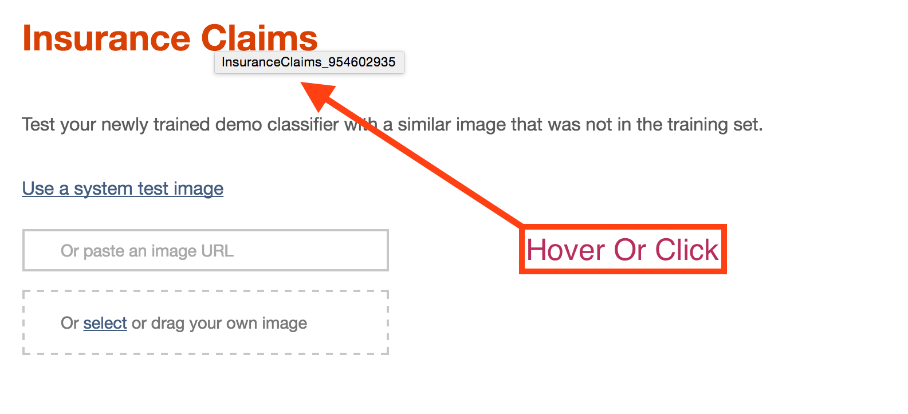

# スマ先生プロト
[](https://travis-ci.org/watson-developer-cloud/visual-recognition-nodejs?branch=master)
[](https://codecov.io/github/watson-developer-cloud/visual-recognition-nodejs?branch=master)

スマ先生プロトは、ワトソンのConversation、Visual Recognition, Discoveryをミックスアップして、会話(C)しながら写真を認識(VR)、よいかどうかを発見的に判断(D)する。
Give it a try! Click the button below to fork into IBM DevOps Services and deploy your own copy of this application on Bluemix.

[](https://bluemix.net/deploy?repository=https://github.com/watson-developer-cloud/visual-recognition-nodejs)

## Getting Started

1. Create a Bluemix Account:

  [Sign up][sign_up] in Bluemix, or use an existing account. If creating an account, you'll have to first create an organization and a space - you should be prompted to do this when you sign in for the first time.

2. Download and install the [Cloud-foundry CLI][cloud_foundry] tool.

3. Edit the `manifest.yml` file, and change the `- name: visual-recognition-demo` line to something unique.
  ```yml
  ---
  declared-services:
    visual-recognition-service:
      label: watson_vision_combined
      plan: free
  applications:
  - name: <application-name>
    path: .
    command: npm start
    memory: 512M
    services:
    - visual-recognition-service
    env:
  NODE_ENV: production
  ```
  The name you use determines your initial application URL, e.g. `<application-name>.mybluemix.net`.

4. Connect to Bluemix in the command line tool.
  ```sh
  $ cf login -u <your user ID>
  $ cf api https://api.ng.bluemix.net
  ```

5. Create the Visual Recognition service in Bluemix.
  ```sh
  $ cf create-service watson_vision_combined free visual-recognition-service
  ```

7. Push it live!
  ```sh
  $ cf push
  ```

8. You can now visit `<application-name>.mybluemix.net` to check out the demo! 

See the full [API Reference](http://www.ibm.com/watson/developercloud/visual-recognition/api/v3/) documentation for more details, including code snippets and references.

## Running locally
  The application uses [Node.js][node_js] and [npm][npm] so you will have to download and install them as part of the steps below.

1. Create a file named .env in the root directory of the project with the following content:

    ```none
    VISUAL_RECOGNITION_API_KEY=<api_key>
    ```
    You can see the `<api_key>` of your application using the `cf env` command:

    ```sh
    $ cf env <application-name>
    ```
    Example output:
    ```sh
    System-Provided:
    {
    "VCAP_SERVICES": {
      "watson_vision_combined": [{
          "credentials": {
            "url": "<url>",
            "api_key": "<api_key>",
          },
        "label": "visual_recognition",
        "name": "visual-recognition-service",
        "plan": "standard"
     }]
    }
    }
    ```

2. Install [Node.js][node_js]. Installing Node JS will also install [npm][npm].

3. Go to the project folder in a terminal and run
    ```sh
    $ npm install
    ```

4. Start the application by running
    ```sh
    $ npm start
    ```

5. Go to `http://localhost:3000` in the browser to view the demo!

## Troubleshooting

To view your logs and troubleshoot your Bluemix application, run:

  ```sh
  $ cf logs <application-name> --recent
  ```

## Environment Variables

  - `VISUAL_RECOGNITION_API_KEY` : This is the API key for the vision service, used if you don't have one in your bluemix account.
  - `PRESERVE_CLASSIFIERS` : Set if you don't want classifiers to be deleted after one hour. *(optional)* 
  - `GOOGLE_ANALYTICS` :Set to your google analytics key, if you want analytics enabled.  *(optional)* 
  - `PORT` : The port the server should run on. *(optional, defaults to 3000)*
  - `OVERRIDE_CLASSIFIER_ID` : Set to a classifer ID if you want to always use a custom classifier. This classifier will be used instead of training a new one. *(optional)*

## Changing the Included Images

### Sample Images

The sample images are the first 7 images when the site loads.  They
are called from a Jade mixin found in
`views/mixins/sampleImages.jade`.  If you just want to replace those
images with different images, you can replace them in
`public/images/samples` and they are numbered 1 - 7 and are `jpg`
formatted.

### Custom Classifier Bundles

Adding new/different custom classifer bundles is much more invovled.
You can follow the template of the existing bundles found in
`views/includes/train.jade`.

Or, you can train a custom classifier using the api or the form and
then use the classifier ID.  

## Getting the Classifier ID

When you train a custom classifier, the name of the classifier is
displayed in the test form.



If you hover your mouse over the classifier name, the classifier ID
will be shown in the tooltip. You can also click on the name, and it
will toggle between the classifier name and the classifier ID.

You can then use this custom classifier id by placing it after the hash
in the request URL.  For example, lets say you are running the system
locally, so the base URL is `http://localhost:3000` and then you train
a classifier.  This newly trained classifier might have an id like
`SatelliteImagery_859438478`.   If you wanted to use this classifier
instead of training a new one, you can navigate to
`http://localhost:3000/train#SatelliteImagery_859438478` and use the
training form with your existing classifier.

## License

  This sample code is licensed under Apache 2.0. Full license text is available in [LICENSE](LICENSE).

## Contributing

  See [CONTRIBUTING](CONTRIBUTING.md).

## Open Source @ IBM
  Find more open source projects on the [IBM Github Page](http://ibm.github.io/).

### Privacy Notice

This node sample web application includes code to track deployments to Bluemix and other Cloud Foundry platforms. The following information is sent to a [Deployment Tracker][deploy_track_url] service on each deployment:

* Application Name (`application_name`)
* Space ID (`space_id`)
* Application Version (`application_version`)
* Application URIs (`application_uris`)

This data is collected from the `VCAP_APPLICATION` environment variable in IBM Bluemix and other Cloud Foundry platforms. This data is used by IBM to track metrics around deployments of sample applications to IBM Bluemix. Only deployments of sample applications that include code to ping the Deployment Tracker service will be tracked.

### Disabling Deployment Tracking

Deployment tracking can be disabled by removing `require('cf-deployment-tracker-client').track();` from the beginning of the `server.js` file at the root of this repo.

[deploy_track_url]: https://github.com/cloudant-labs/deployment-tracker
[service_url]: http://www.ibm.com/watson/developercloud/visual-recognition.html
[cloud_foundry]: https://github.com/cloudfoundry/cli
[visual_recognition_service]: https://www.ibm.com/watson/developercloud/visual-recognition.html
[sign_up]: https://console.ng.bluemix.net/registration/
[getting_started]: https://www.ibm.com/watson/developercloud/doc/common/index.html
[node_js]: http://nodejs.org/
[npm]: https://www.npmjs.com


